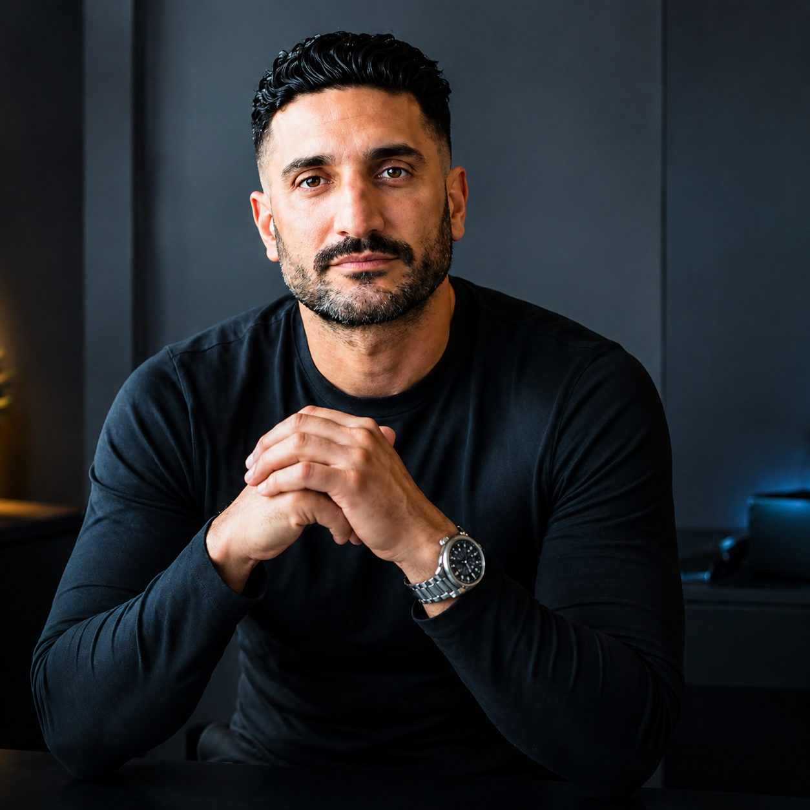

# Frank Anthony Portfolio

  

  <strong>Full Stack AI &amp; Cloud Engineer</strong>

## About Me

I build intelligent, production-ready software where AI meets dependable engineering. My work connects AI applications, data systems, cloud infrastructure, and modern full-stack development to create products that deliver measurable business value.

### What I Do

- 🤖 **AI Engineering:** LLM applications, RAG systems, AI agents, and practical automation.
- 🧩 **Full-Stack Products:** Reliable frontend, backend, API, and database systems built for real users.
- ☁️ **Cloud & Data:** Scalable cloud architecture, data pipelines, and operational foundations that hold up in production.

I bring a product-minded, systems-first approach to complex technical challenges, with a focus on quality, clarity, and long-term reliability.
